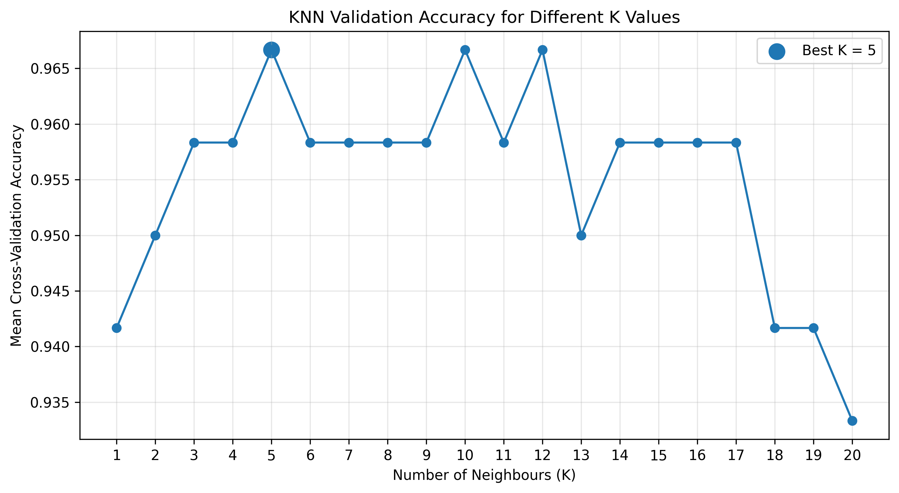
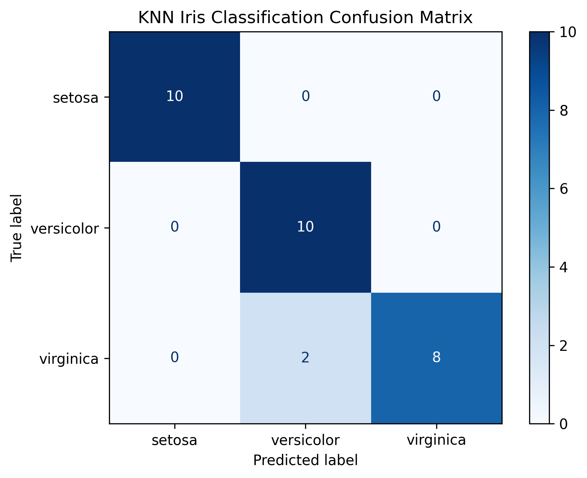

# Iris Flower Classification Using KNN

## Project Overview

This project was developed as Project 2 of the DecodeLabs Artificial
Intelligence Internship 2026.

It uses supervised machine learning to classify Iris flowers into three
species based on four flower measurements.

## Classes

- Iris Setosa
- Iris Versicolor
- Iris Virginica

## Input Features

- Sepal length
- Sepal width
- Petal length
- Petal width

## Dataset

The Scikit-learn Iris dataset contains:

- 150 samples
- 4 numerical features
- 3 balanced flower classes
- No missing values

## Machine-Learning Workflow

1. Load and explore the Iris dataset
2. Separate features and target labels
3. Split the data into 80% training and 20% testing sets
4. Select the best K value using five-fold cross-validation
5. Scale features using StandardScaler
6. Train a K-Nearest Neighbors classifier
7. Predict the species of unseen test samples
8. Evaluate the model using accuracy, precision, recall, F1-score,
   and a confusion matrix
9. Predict the species of a new flower

## Model

The project uses the K-Nearest Neighbors classification algorithm.

The best K value was selected by comparing values from 1 to 20 using
five-fold cross-validation.

## Results

- Best K value: 5
- Cross-validation accuracy: 96.67%
- Test accuracy: 93.33%
- Macro F1-score: 0.9327
- Correct test predictions: 28 out of 30

The model correctly classified all Setosa and Versicolor test samples.
Two Virginica samples were classified as Versicolor.

## Visualizations

### K Selection



### Confusion Matrix



## Technologies Used

- Python
- Pandas
- Matplotlib
- Scikit-learn
- K-Nearest Neighbors
- StandardScaler
- Cross-validation

## How to Run

Install the required libraries:

```bash
pip install -r requirements.txt